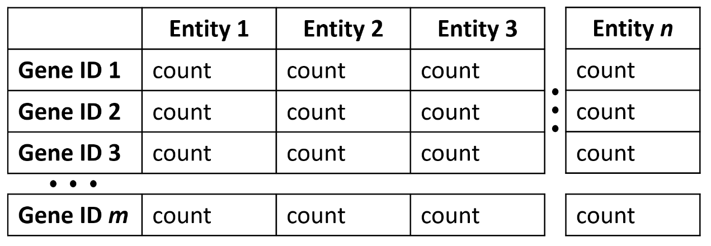

### SPOT - Swift Profiling of Transcriptomes
The increasing number of single cell and bulk RNAseq data sets describing complex gene expression profiles in different organisms, organs or cell types calls for an intuitive tool allowing rapid comparative analysis. Here we present Swift Profiling Of Transcriptomes (SPOT) as a web tool that allows not only differential expression analysis but also fast ranking of genes fitting transcription profiles of interest. Based on a heuristic approach the spot algorithm ranks the genes according to their proximity to the user-defined gene expression profile of interest. The best hits are visualized as a table, bar chart or dot plot and can be exported as an Excel file. While the tool is generally applicable, we tested it on RNAseq data from malaria parasites that undergo multiple stage transformations during their complex life cycle as well as on data from multiple human organs during development and cell lines infected by the SARS-CoV-2 virus. SPOT should enable non-bioinformaticians to easily analyse their own and any available dataset.


(A) Logic and (B) workflow of SPOT. (C) Cartoon version of the SPOT web interface highlighting specific functions

### Installation

An online version is available via [frischknechtlab.shinyapps.io/SPOT_beta/](https://frischknechtlab.shinyapps.io/SPOT_beta/)

For R installation please visit the [r-project](https://cloud.r-project.org/).
If you have R installed, SPOT can be run locally via:
```json
    if (!requireNamespace("shiny", quietly = TRUE))
        install.packages("shiny")
    shiny::runGitHub("EliasFarr/SPOT")
```
### Upload format

Normalized count files for upload should have entities as first row and a gene identifier as first column (see below and Example file). Counts should be in TPM normalization. Raw counts should have a first row, in which the cell identity is stated. .csv files should have semicolons as separator and commas as decimal separator. Example files are provided in the main folder (Example_normcounts, Example_rawcounts). Please note, that SPOT was created for raw and normalized single cell - , as well as normalized bulk RNAseq datasets. For analysis of raw bulk RNAseq counts please use the existing tools.

<p align="center" #>
     
</p>

### Data

Data was obtained from: 

>Howick, V.M. u. a., 2019. The Malaria Cell Atlas: Single parasite transcriptomes across the complete Plasmodium life cycle. Science, 365(6455), S.774. [Paper](https://science.sciencemag.org/content/365/6455/eaaw2619) [Data](https://github.com/vhowick/MalariaCellAtlas/tree/master/Expression_Matrices/Smartseq2)

>Cardoso-Moreira, M. u. a., 2019. Gene expression across mammalian organ development. Nature, 571(7766), S.505–509. [Paper](https://www.nature.com/articles/s41586-019-1338-5) [Data](https://www.ebi.ac.uk/arrayexpress/experiments/E-MTAB-6814/)

>Wyler E., et al., 2021. Transcriptomic profiling of SARS-CoV-2 infected human cell lines identifies HSP90 as target for COVID-19 therapy. iScience, 24(3), 102151. [Paper](https://www.sciencedirect.com/science/article/pii/S258900422100119X?via%3Dihub#undfig1) [Data](https://www.ncbi.nlm.nih.gov/geo/query/acc.cgi?acc=GSE148729)

### Citation

If you use SPOT please cite as follows:

>Elias Farr, Julia M Sattler, Friedrich Frischknecht, SPOT: a web-tool enabling Swift Profiling Of Transcriptomes; Biorxiv 2021 [Doi](https://doi.org/10.1101/2021.03.03.433767)

### Requirements

All code was excecuted with R 4.0.3. Package requirements are listed below. R environment can be restored via `renv::restore()` using the provided `renv.lock` file.

package | version
--- | ---
DESeq2	| 1.30.1
DT	| 0.18
edgeR | 3.32.1
EnvStats	| 2.4.0
limma| 3.46.0
MAST	| 1.16.0
matrixStats	| 0.58.0
Plotly	| 4.9.3
plyr	| 1.8.6
reshape2	| 1.4.4
rlist| 	0.4.6.1
scales	| 1.1.1
Seurat	| 4.0.1
Shiny	| 1.6.0
shinybusy	| 0.2.2
shinycssloaders	| 1.0.0
shinyEffects	| 0.2.0
shinywidgets	| 0.6.0
sortable	| 0.4.4
stringr	| 1.4.0
tidyr	| 1.1.3
